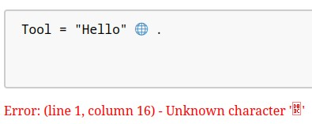

# EBNF Railroad Diagram Visualizer
A client-side browser-based tool for visualizing EBNF grammars as railroad diagrams.
Uses the [Wirth Syntax Notation](https://en.wikipedia.org/wiki/Wirth_syntax_notation) (*WSN*) for EBNF, as this is the common format used by the [Institute for System Software](https://ssw.jku.at/) (SSW) at Johannes Kepler University.

This project is a part of the course [Project in Software Engineering](https://ssw.jku.at/Teaching/Lectures/PSE/2024SS/index.html) at the SSW and is supervised by [Dr. Markus Weninger](https://ssw.jku.at/General/Staff/Weninger/).

> [!TIP]
> Almost all of the provided images are clickable and bring you to the visualizer with the matching input.

## Implementation expectations
The grammar expects a correctly formatted EBNF grammar in WSN. Uppercase identifiers are treated as Non-Terminal Symbols (*NTS*). Lowercase identifiers are treated as Terminal Symbols (*TS*) which cannot be broken down further, e.g. `an` which may stand for a-z, A-Z and 0-9.

The grammar is automatically parsed and visualized as a railroad diagram when an input is detected. Errors are displayed below the input grammar if any occur.

## Usage on provided website
I host the project on my own website: https://wtf-my-code.works/rr-diagram/.  
Should you encounter any issues, please let me know by creating an issue on this repository. In the meantime you can use the mirror hosted via [GitHub Pages](https://mrminemeet.github.io/ebnf_railroad_visualizer/).

If you want to use the package yourself, you can find the installation [further down](#installation-within-another-project).

## Example
The following input results in the railroad diagram below:
```ebnf
Path = Dir { Dir } Name .
Dir = ( Name | "." [ "." ] ) "/" .
Name = an { an } .
```
[](https://wtf-my-code.works/rr-diagram/?grammar=UGF0aCA9IERpciB7IERpciB9IE5hbWUgLgpEaXIgPSAoIE5hbWUgfCAiLiIgWyAiLiIgXSApICIvIiAuCk5hbWUgPSBhbiB7IGFuIH0gLg).

## Features
* **Error Information:** In the case that an error occurs during scanning or parsing of the input grammar, a small description is written below the grammar as shown:  


* **NTS Expansion:** NTS are displayed as rectangles and can be expanded by clicking them. The definition of the NTS is then displayed in a dashed box as shown:  
[](https://wtf-my-code.works/rr-diagram/?grammar=UGF0aCA9IERpciB7IERpciB9IE5hbWUgLgpEaXIgPSAoIE5hbWUgfCAiLiIgWyAiLiIgXSApICIvIiAuCk5hbWUgPSBhbiB7IGFuIH0gLg&expand=MTItMTEtMTAtMi0xfDEyLTExLTEwLTktOA)

* **URL Encoded Grammar:** Grammar is base64URL encoded into the URL. This allows for easy sharing of the current grammar by copying the URL or bookmarking it. The encoding also includes the list of expanded NTS.  
The URL encoding also utilizes GZip via `CompressionStream` to compress the grammar and expand parameter in order to reduce their length. Before `lz-string` was used, which is now being phased out in this project and only loaded on demand.  
 A size comparison was performed on the grammar for [MicroJava](https://www.ssw.jku.at/Misc/CC/Handouts.pdf) with the following results:

|                    |Grammar|URL Encoded|Base64 Encoded|lz-string Compressed Base64|gzip Compressed Base64|
|--------------------|-------|-----------|--------------|---------------------------|----------------------|
|Size in Chars       |   1003|       1789|          1340|                        792|                   624|
|Size rel. to Grammar|   100%|     178,4%|        133,4%|                      78,9%|                 62,2%|

This only includes the grammar length, not the encoded expands. 

* **Selectable Start Symbols:** The start symbol can be selected by either choosing the desired NTS in the dropdown menu or by performing a *CTRL + L-Click* on it in the railroad diagram. By default the declared NTS of the first production is used. The selected start symbol is also encoded in the URL for easy sharing.

* **Compacted 0…n Repetition:**
If the repetition only contains of TS, then the content is compacted onto the back-edge and the forward-edge is kept empty. This is shown in the following picture:  
[](https://wtf-my-code.works/rr-diagram/?start=Example&grammar=RXhhbXBsZSA9IHsgIiwiIHggfSAu)

* **1…n Repetition detection:** 
The repetition detection has two versions that are applied
	1. *Advanced Repetition Detection* - for e.g. `x { "," x }`, which removes the `x` in front of the repetition and converts the repetition to a `ZeroOrMore` repetition. The inner `x` is on the forward edge of the repetition and the `","` being on the backward edge as shown in the following picture:  
	[](https://wtf-my-code.works/rr-diagram/?start=Example&grammar=RXhhbXBsZSA9IHggeyAiLCIgeCB9IC4&expand=MTItMTEtMTAtNi01LTQtM3wxMi0xMS0xMC04)

	2. *Basic Repetition Detection* - for e.g. `x { x }`, which removes the `x` in front of the repetition and converts the repetition to a `OneOrMore` repetition. The inner `x` is on the forward edge of the repetition as shown in the following picture:  
	[](https://wtf-my-code.works/rr-diagram/?start=Example&grammar=RXhhbXBsZSA9IHggeyB4IH0gLg)

## TODOs
* Make UI nicer and a bit more user-friendly. Maybe also add some instructions and a dark mode 🌕

## Installation within another project
Found on [NpmJs](https://www.npmjs.com/package/ebnf-railroad-visualizer)

The `ebnf-railroad-visualizer` package can be used by importing the `install(…)` function from the package. The function takes a single argument, which is the `Window` object, that the package will use to install the visualizer.

### Installation
Import the package and it's dependency like shown below:
```javascript
import { install } from 'ebnf-railroad-visualizer';
import * as d3 from 'https://cdn.jsdelivr.net/npm/d3@7/+esm'; // Optional, but recommended

install(window, d3);
```

The generated diagrams require some CSS to be displayed correctly. The CSS can be found in the [railroad.css](./css/railroad.css) file, which has been adapted a bit from the [original file](https://github.com/tabatkins/railroad-diagrams/blob/gh-pages/railroad.css).

### Expected HTML Objects
The `install`-method expects the following HTML objects on the page:
* `error_message` - Container for error messages.
* `visualized-ebnf` - Container for the diagram.
* `ebnf_grammar` - Textarea for the EBNF grammar.
* `.start-symbol-drop-down` - Container for the start symbol dropdown.
* `start-symbol` - Select for the start symbol.

### Provided Functions and Properties
In return, the package provides the following functions on the `window` object:
* `generateDiagram` - Generate the diagram from the entered grammar
* `handleGenerateDiagram` - Handle the generation of a diagram from the entered grammar
* `handleStartSymbolSelection` - Handle the selection of the start symbol
* `onCollapseAll` - Collapse all NTS (e.g. onClick)
* `onExpandAll` - Expand all NTS (e.g. onClick)
* `exportSvg` - Export the diagram as SVG (e.g. onClick)
* `exportPng` - Export the diagram as PNG (e.g. onClick)

Furthermore, the following properties are attached to the `window` object.
These can be set from another location to change the extended NTS or the start symbol.
* `window.chooChoo.toExtend` - List of NTS to extend
* `window.chooChoo.startSymbol` - Start symbol

**For further information, please check out the [source code](./src/) and the [index.html](./index.html) file.**

## Included Dependencies / Other Resources
- [railroad.js](https://github.com/tabatkins/railroad-diagrams) by Tab Atkins Jr. et. al (with some modifications, see comment in the file at line ~16)
	- Provided as MIT (according to Github Repository) and CC0 (according to file itself)
- [lz-string.js](https://github.com/pieroxy/lz-string) by pieroxy |
	- Provided as MIT (according to Github Repository) and WTFPL (according to file itself)
 	- Phasing out (replaced by [CompressionStreams](https://developer.mozilla.org/en-US/docs/Web/API/Compression_Streams_API))
- [D3](https://github.com/d3/d3) by Mike Bostock et. al
	- Provided as ISC. **Optional dependency**
- [github-mark.svg](https://github.com/logos) by GitHub. **Only used on website**

## License
EBNF Railroad Diagram Visualizer © 2024 by Alexander Voglsperger is licensed under CC BY 4.0. To view a copy of this license, see [LICENSE](./LICENSE) or visit https://creativecommons.org/licenses/by/4.0/.


